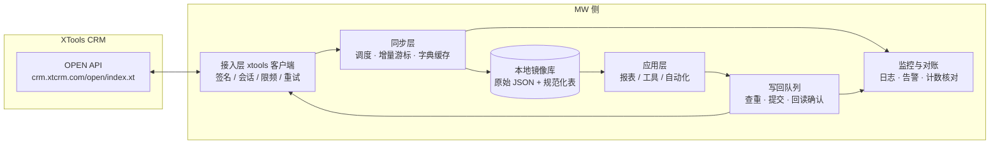

# XTools CRM 接入同步方案设计

麦可旺志 Microwants · xtools 优化项目 · 2026-09-11
依据：《XToolsCRM OPEN API》文档（2026-05-22）与《02_接口机制与签名说明》《04_首批四模块字段映射》。

## 1. 目标与原则

1. 以 XTools CRM 为客户、订单、产品、回款等业务数据的主数据源；我方系统先建立只读镜像，再按业务需要有控制地写回。
2. 读取以增量为主、全量为校验；写回以“先查重、后提交、再回读”为固定顺序。
3. 单一同步进程持有会话，避免触发登录限频与会话互踢。
4. 枚举、字段中文名、人员对照均来自 CRM 字典接口，不在代码中硬编码。

## 2. 总体架构

| 层 | 职责 | 实现 |
|---|---|---|
| 接入层 | 请求签名、sid 缓存与自动重登、登录限频等待、读取重试、错误分类 | `xtools/client.py`（已完成） |
| 同步层 | 按表维护游标（lastid / lasttime）、分页拉取、字典缓存、任务调度 | 待开发，建议以 `sync_state` 表记录每表的游标与上次运行结果 |
| 存储层 | 保存原始 JSON（便于追溯）与规范化表（便于查询） | 起步用 SQLite，数据量或并发上升后迁移 PostgreSQL |
| 写回层 | 变更队列、唯一键查重、调用写入 / 修改 / 动作接口、回读确认、失败重试策略 | 待开发 |
| 应用层 | 报表、查询工具、自动化流程 | 按项目需求 |
| 监控 | 运行日志、异常告警、镜像与 CRM 计数对账 | 待开发 |

## 3. 读取同步策略

| 表（dt） | 首次全量 | 增量方式 | 建议频率 | 说明 |
|---|---|---|---|---|
| user、字典、字段名、人员对照 | 一次 | 每日重拉 | 每日 | 字典变更频率低 |
| customer（extend=1） | lastid 翻页 | lasttime（含新增与修改） | 15–30 分钟 | 含联系人与扩展字段 |
| customerext | lastid 翻页 | lastid（新增）+ 每日全量 | 每日 | 无 lasttime 过滤 |
| product | lastid 翻页 | lasttime | 30 分钟 | 含库存数量 lnum；启用外部库存后库存以我方为准 |
| csstree、prod_alias | lastid 翻页 | 每日全量 | 每日 | 数据量小 |
| contract（extend=1） | lastid 翻页 | lastid（新增）+ 按 date 区间或 status=1 重拉活动订单 | 15–30 分钟 | 无 lasttime；已有订单的修改需靠重拉发现 |
| sendgoods | lastid 翻页 | lastid + 关联活动订单重拉 | 30 分钟 | |
| libout | lastid 翻页 | lasttime | 30 分钟 | |
| sr_notice | — | status=1（API 未读）轮询 | 5–10 分钟 | 仅在启用外部库存时 |
| gathering、gathering_note | lastid 翻页 | lastid + 未回款计划重拉 | 每小时 | |
| purchase、pay_plan | lastid 翻页 | lastid + 活动单据重拉 | 每小时 | |
| cost、costdetail | lastid 翻页 | lasttime（cost） | 每日 | 读取为主 |

实现要点：

1. 每表一个游标记录：`dt、lastid、lasttime、last_run_at、last_status、rows`。
2. 增量拉取采用“上次 lasttime 减去 10 分钟”作为起点，允许重叠，以主键 id 去重合并。
3. 全量校验：每日对比镜像行数与 CRM 侧按 lastid 扫描的行数；不一致时对该表触发全量重拉。
4. 原始 JSON 保留 `fetched_at` 与 `source_hash`，规范化表由原始表派生，便于字段映射调整后重建。

## 4. 写回流程

### 4.1 通用顺序

1. 应用层将变更写入 `writeback_queue`（含业务类型、目标 dt、data、我方唯一键、状态）。
2. 提交前查重：客户按 sn 或 name，订单按 "No."，发货单 / 回款记录 / 计划回款按 memo（写入时将我方单号写入 memo），产品按 sn。命中即转为修改或跳过。
3. 调用写入或修改接口（`idempotent=False`，网络超时不自动重发）。
4. 成功后按返回的 id 或唯一键回读，确认字段落库，再标记队列项完成。
5. 失败分类：签名 / 会话类由客户端自动处理；业务类（编号重复、客户不存在等）记录 msg 并人工处理；网络类先回读确认是否已写入，再决定是否重试。

### 4.2 各模块的依赖顺序

客户（含联系人）→ 产品与分类 → 订单（明细引用产品编码）→ 发货 / 出库（引用订单编号）→ 回款、开票（引用客户编号与订单）。上游未同步成功时，下游变更在队列中等待。

### 4.3 需特别处理的接口

| 场景 | 处理 |
|---|---|
| 订单、报价单修改 | 先读取当前完整明细，合并变更后整体回写（明细全量替换） |
| 入库 / 出库 | 写入取得 id → 校验 → 调用 libinok / liboutok；两步之间失败时以 id 重试完成动作 |
| 收发货通知单 | 读取（status=1）→ 写入我方 → chgst status=2 并回填 erp_no → 我方执行 → 再读确认未关闭 → exc（no_more=1）→ erp_libn 更新外部库存；任一回写失败即停止后续动作并告警 |
| 客户所有者 | 写入后调用 api.chgown；批量导入时按业务员分批 |
| 批单报销审批 | 仅在需要终结 CRM 审批时传 aprv_status（4 / 5） |

## 5. 主数据与冲突规则

| 数据 | 主数据源 | 冲突处理 |
|---|---|---|
| 客户、联系人 | CRM | 我方修改经写回后以 CRM 回读结果为准 |
| 产品目录 | CRM（或我方 PIM，待定） | 若我方为主数据，则产品写入 / 修改单向推送，CRM 侧修改视为异常并告警 |
| 库存数量 | 启用外部库存时为我方，否则为 CRM | 启用外部库存后以 erp_libn 推送 |
| 订单 | CRM | 我方只新建与按规则修改，状态以 CRM 为准 |
| 回款、开票 | 财务系统（若有）→ CRM | 单向写入，回读校验金额 |

## 6. 分阶段计划

| 阶段 | 内容 | 验收 |
|---|---|---|
| P0 只读镜像 | 凭证与冒烟测试；字典导出；customer / product / contract / gathering_note 全量 + 增量落库；对账脚本 | 镜像行数与 CRM 一致，增量延迟不超过 30 分钟 |
| P1 客户与产品写回 | 客户新建 / 修改 / 转移、自定义字段写入、产品新建 / 修改、分类与别名 | 在测试公司完成 20 条以上写入并回读一致 |
| P2 订单与发货 | 订单新建 / 修改、发货单修改、出入库写入与完成；若启用外部库存则接入通知单流程 | 订单明细与金额与我方一致；通知单流程无遗漏与重复执行 |
| P3 财务 | 计划回款、回款记录、开票记录与开票动作、付款计划、采购单 | 金额、期次、关联订单回读一致 |
| P4 运营 | 监控告警、对账报表、凭证轮换流程、文档更新 | 连续运行 2 周无人工介入 |

## 7. 运行与监控

1. 部署为单一常驻进程（或定时任务串行执行），同一 part 不并发登录。
2. 日志：每次调用记录 cmd、dt、耗时、返回 ok、记录数；密钥与 sid 脱敏（客户端已实现）。
3. 告警：连续登录失败、签名错误、业务错误率上升、增量长时间无数据、对账差异。
4. 对账：每日按表比较行数与抽样字段；差异写入报表并保留 30 天。
5. 凭证：只保存在环境变量或密钥管理；定期与 XTools 协商轮换 appkey。

## 8. 待与 XTools 确认后再定的设计点

1. 是否启用外部库存（决定库存主数据与通知单流程是否纳入 P2）。
2. 同一 part 重复登录是否互踢（决定能否多进程并行读取）。
3. 是否存在调用量限制（决定增量频率上限）。
4. 联系人的单独修改途径、开票申请的读取途径（文档未提供）。
5. 测试公司的提供方式（决定 P1–P3 的验证环境）。
